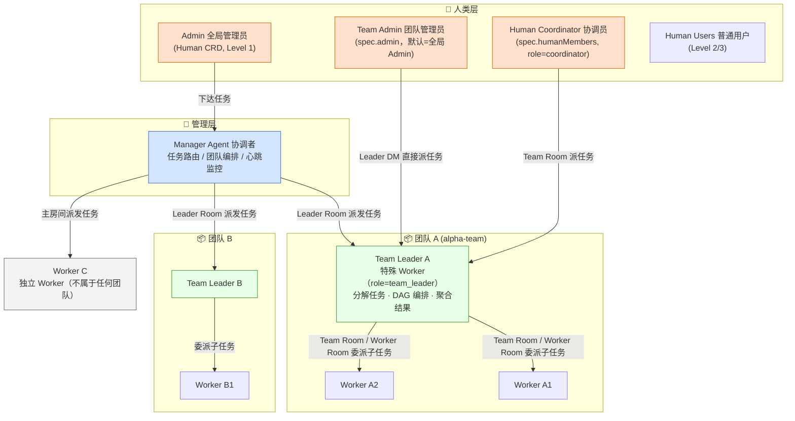
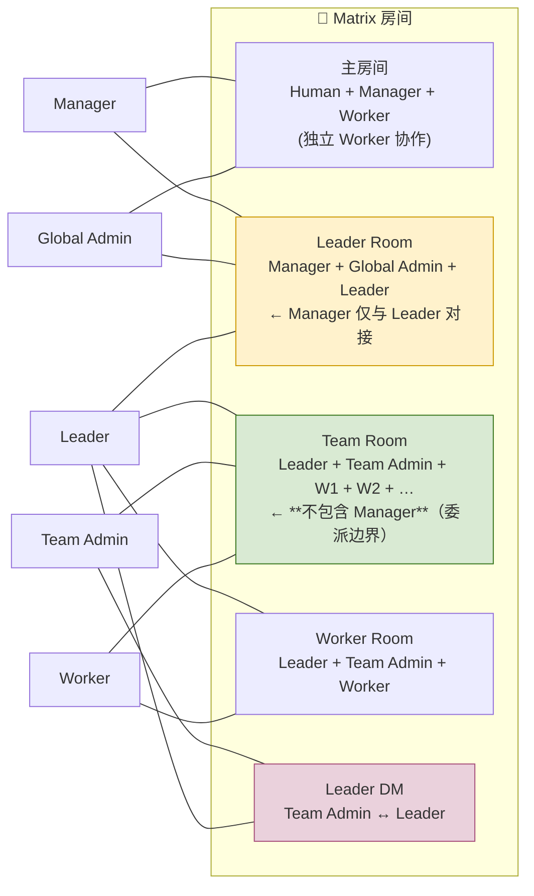
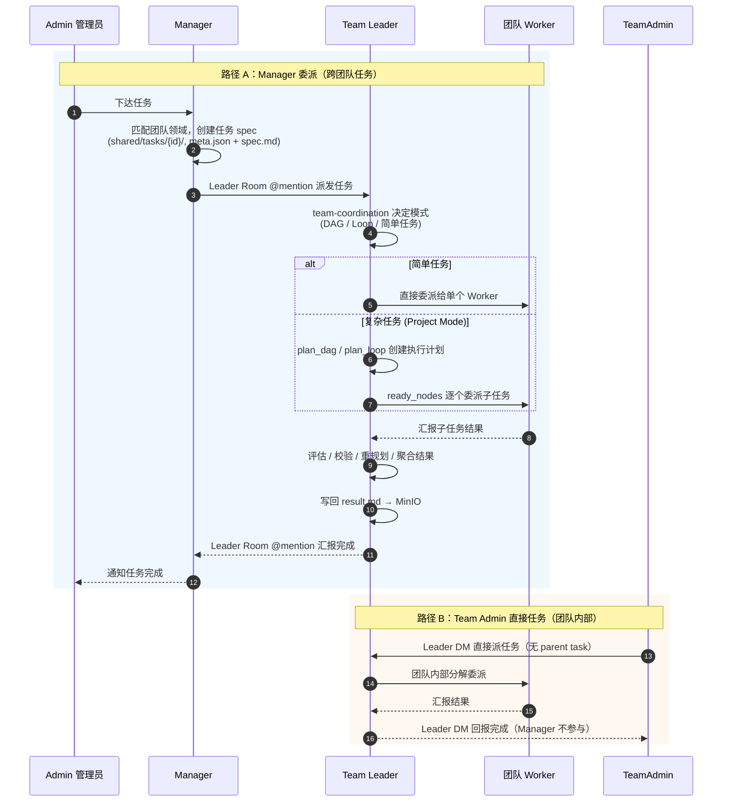
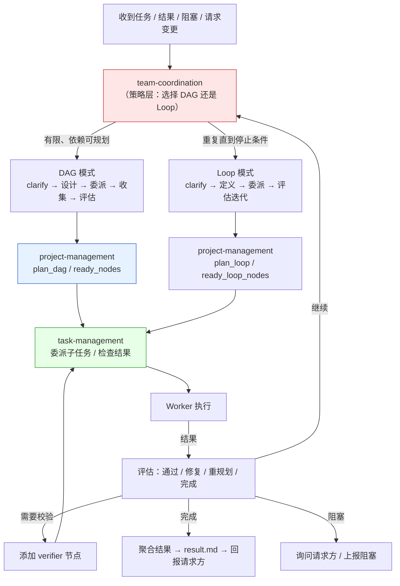

# 成员协调图

> 根据 HiClaw 代码库（`docs/declarative-resource-management.md`、`manager/agent/team-leader-agent/`、`manager/agent/skills/team-management/`）整理的成员协调关系。
>
> 互补文档：[成员调谐流程](./member-reconcile-flow.md) 讲「单个成员如何被 Controller 调谐上线」（Infra → ServiceAccount → Config → Pod → 端口暴露）；本文讲「成员之间如何通信与委派」。

## 1. 组织结构与协调关系

**角色说明：**

| 成员 | 角色 | 职责 |
|------|------|------|
| Admin | 全局人类管理员 | 向 Manager 下达任务；可进入各房间监督 |
| Manager | AI 协调者 | 任务路由、Worker/Team 编排；**只与 Leader 对接，绝不直接指挥团队 Worker** |
| Team Leader | 特殊 Worker | 接收 Manager / Team Admin 的任务，分解、DAG 编排、委派、聚合回报 |
| Worker | 执行单元 | 执行子任务，向 Leader 汇报；`spec.peerMentions=true` 时可在 Team Room 互 @ |
| Team Admin | 团队专属管理员 | 通过 Leader DM 直接向 Leader 派任务，Manager 不参与 |
| Coordinator | 人类协调员 | 加入 Team Room，可像 Team Admin 一样在团队内派任务 |

## 2. Matrix 房间通信拓扑

**关键设计**：Team Room **不包含 Manager** —— 这是委派边界。Manager 通过 Leader Room 与 Leader 沟通，团队内部协调由 Leader 全权负责。

## 3. 任务协调时序

## 4. 协调决策流（Team Leader 内部策略层）

**配套技能**（Team Leader 工作区 `skills/`）：

| 技能 | 用途 |
|------|------|
| `team-coordination` | 协调策略层：DAG vs Loop、质量门禁、并行边界 |
| `project-management` | Project 状态、DAG/Loop 执行计划、ready-node 解析 |
| `task-management` | 子任务委派、结果检查、阻塞/修订处理 |
| `file-sharing` | 读写 `shared/`（团队可见）与 `global-shared/`（Manager 输入） |
| `organization` | 团队拓扑、Matrix 身份、房间查询 |
| `communication` | 消息纪律（何时 @mention、回报、NO_REPLY） |

## 5. 协调规则要点

1. **绝不绕过 Leader** — 与团队 Worker 的所有沟通都经由 Leader。
2. **一次委派一个任务** — 不同时给同一 Leader 派多个无关任务。
3. **信任 Leader 的分解** — Manager 不干预子任务分配与模式选择。
4. **升级路径** — Leader 报 BLOCKED 时，Manager 升级给 Admin。
5. **@mention 纪律** — 仅任务完成 / 阻塞 / 需要决策时 @mention 请求方，避免回声循环。
6. **Team Admin 任务独立** — Manager 不追踪、不干涉 Team Admin 发起（Leader DM）的任务。
