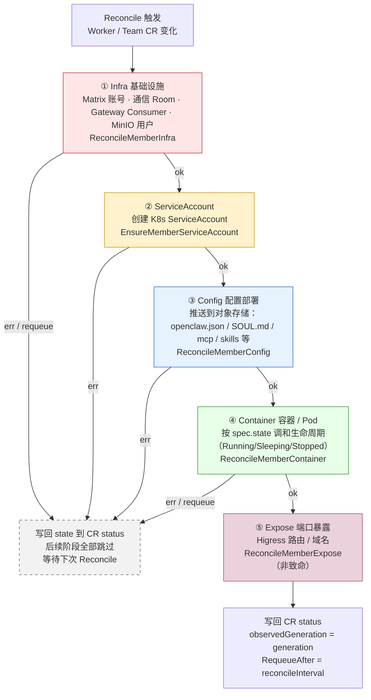
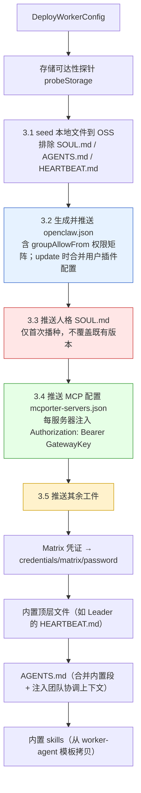

# 成员调谐流程

> 本文档描述 **一个成员（Worker / Team Leader / Team Worker）从声明到就绪** 的 Controller 调谐（reconcile）流水线——即「创建一个成员时，Controller 实际执行了哪些步骤、按什么顺序、出错如何处理」。
>
> 与 [成员协调图](./member-coordination.md) 互补：前者讲「成员之间如何通信与委派」，本文讲「单个成员如何被基础设施层调谐上线」。

## 1. 概述

HiClaw Controller 采用标准 Kubernetes Controller 模式：用户声明期望状态（Worker / Team / Human / Manager CR），Controller 通过 **Reconcile Loop** 持续将实际状态收敛到期望状态。本文聚焦其中 **成员（worker-like）** 的调谐路径。

**核心特点：**

- **不是状态机，而是阶段式命令序列。** 成员调谐由五个固定顺序的阶段组成，每阶段失败即提前返回（early-return），后续阶段跳过。没有显式的 `status.conditions` 状态机，进度仅通过标量状态字段（`matrixUserID`、`roomID`、`containerState`、`exposedPorts`、`phase`、`observedGeneration`）记录。
- **两套 Reconciler 共用同一套阶段逻辑。** 独立 `WorkerReconciler` 与 `TeamReconciler`（为 Leader 和每个 Team Worker）都收敛到 `hiclaw-controller/internal/controller/member_reconcile.go` 中的共享阶段函数，仅上游 `MemberContext` 构造方式不同。
- **幂等。** 每个阶段都是 get-or-create 语义，重复调谐不会重复创建（Room 以别名为幂等键、SOUL.md 仅首次播种、openclaw.json 在更新时合并保留用户插件配置）。

成员角色由 `MemberRole`（`member_reconcile.go`）分类：`standalone` / `team_leader` / `worker`。三者在调谐阶段上完全一致，仅在具体配置内容（如 Leader 的 SOUL 模板、AGENTS.md 团队上下文）上有差异。

## 2. 五阶段总览



**阶段调用点**（`worker_controller.go` 的 `reconcileNormal`）：

```
ReconcileMemberInfra          → 失败/requeue 即返回
EnsureMemberServiceAccount    → 失败即返回
ReconcileMemberConfig         → 失败即返回
ReconcileMemberContainer      → 失败/requeue 即返回
ReconcileMemberExpose         → 永远执行，错误被吞（非致命）
```

`TeamReconciler` 对 Leader 与每个 Team Worker 调用**完全相同**的五阶段顺序。

## 3. 阶段详解

### ① Infra —— 基础设施配置

`ReconcileMemberInfra`（`member_reconcile.go`）确保成员的 Matrix 身份、通信 Room、网关 Consumer、对象存储用户就绪，并把产出的凭据包（`WorkerProvisionResult`：MatrixToken、GatewayKey、MinIOPassword、MatrixPassword）写入 `state.ProvResult`，供下游阶段复用。

委托给 `Provisioner.ProvisionWorker`（`internal/service/provisioner.go`），内部按顺序执行五个子步骤：

| 子步骤 | 动作 | 说明 |
|--------|------|------|
| 1 | 加载或生成凭据 | `loadWorkerCredentials` / `GenerateCredentials` |
| 2 | **注册 Matrix 账号** | `matrix.EnsureUser`（worker localpart） |
| 3 | 创建 MinIO 用户 | `ossAdmin.EnsureUser` + `EnsurePolicy`（**仅 embedded 模式**） |
| 4 | 创建通信 Room | `matrix.CreateRoom`，别名 `hiclaw-worker-<name>`（**别名为幂等键**），随后 `ReconcileRoomMembership` + `JoinRoom` |
| 5 | 配置网关授权 | `gateway.EnsureConsumer` + `AuthorizeAIRoutes`（Higress/AI Gateway Consumer + AI 路由授权） |

**首次创建 vs 刷新：** 当 `MemberContext.ExistingMatrixUserID != ""`（即 CR status 已记录过 Matrix 用户）时，走 `RefreshWorkerCredentials` 刷新路径——不重复注册账号、不重复轮换 token，仅补全凭据。Synapse 返回 403 "already in room" 时也被视作已 provision，平滑降级到刷新路径。

### ② ServiceAccount —— K8s 服务账号

`EnsureMemberServiceAccount`（`member_reconcile.go`）委托 `Provisioner.EnsureServiceAccount`（`internal/service/provisioner_sa.go`）：get-or-create 一个 `corev1.ServiceAccount`，名称由 `resourcePrefix.SAName(RoleWorker, workerName)` 决定，带 `hiclaw.io/worker` 与 `hiclaw.io/controller` 标签。

**为什么单独成阶段而不并入 Infra？** 源码注释（`member_reconcile.go`）说明：SA 创建在命名空间初始化后可能与 K8s API 竞态，独立阶段便于单独重试。这一步主要面向 **incluster（K8s）模式**——Pod 需要以该 SA 身份运行，持有可被即时吊销的访问凭证（与 [k8s-native-agent-orch.md](./k8s-native-agent-orch.md) 中「Consumer Token 类比 ServiceAccount Token」的设计一致）。

### ③ Config —— 配置部署到对象存储

`ReconcileMemberConfig`（`member_reconcile.go`）把成员运行所需的全部配置推送到对象存储（OSS/MinIO）的 `agents/<name>/` 前缀下。**仅当 `state.ProvResult != nil`（即 Infra 已完成）才执行**，否则静默跳过——这是阶段依赖的天然门控。

整体调用三组 Deployer 方法，随后是技能推送：

```
DeployPackage         解析/下载/解压并镜像 spec.package
WriteInlineConfigs    将 spec.identity / spec.soul / spec.agents 写入本地 agent 目录
DeployWorkerConfig    【核心】生成并推送所有运行时配置工件（见下方 3.1–3.5）
PushOnDemandSkills    远程技能（nacos）与本地技能推送（非致命）
```

`DeployWorkerConfig`（`internal/service/deployer.go`）内部的推送顺序：



**各子步骤说明：**

- **3.1 推送本地文件** —— `seedLocalAgentFiles` 把本地 agent 目录（含 package 解压内容与 inline 写入的内容）镜像到 OSS 作为**默认基底层**。SOUL.md / AGENTS.md / HEARTBEAT.md 被显式排除——它们各自有专用写入器，混入镜像会与专用写入器竞态，在多次调谐时把陈旧本地副本覆盖回 OSS。
- **3.2 生成运行时 openclaw.json** —— 由 `agentconfig.GenerateOpenClawConfig`（`internal/agentconfig/generator.go`）生成，内含 LLM 端点、Matrix 凭据、`groupAllowFrom` 通信权限矩阵、channelPolicy 增量等。**更新场景下**会读取既有 openclaw.json，通过 `mergeUserPluginConfig` 合并，**保留用户在运行时自定义的插件配置**（如 memory-core dreaming 计划），生成值仅作为新条目的默认。
- **3.3 推送人格 SOUL.md** —— **仅首次播种，之后永不覆盖**（Agent 启动后拥有该文件的所有权）。优先级：`spec.soul` / `spec.identity` 内联内容 > 本地模板 > 占位默认。**Team Leader 跳过此块**，其 SOUL 由 `renderAndPushSoulTemplate` 从 `SOUL.md.tmpl` 渲染（见下文「Team Leader 特例」）。
- **3.4 推送 MCP 配置** —— 当 `spec.mcpServers` 非空时，`GenerateMcporterConfig`（`internal/agentconfig/mcporter.go`）生成 `mcporter-servers.json`，为每个 MCP Server 注入 `Authorization: Bearer <GatewayKey>`。Worker 永远只持有 Consumer Token，真实凭证（GitHub PAT 等）只在 Gateway 内部——详见 [k8s-native-agent-orch.md](./k8s-native-agent-orch.md)「基于 Higress 的 LLM/MCP 安全访问模型」。
- **3.5 推送其余工件** —— Matrix 密码（`credentials/matrix/password`，供 E2EE 重新登录）、内置顶层文件（Team Leader 的 `HEARTBEAT.md`）、`AGENTS.md`（合并内置段 + 注入团队协调上下文，见下）、内置 skills。

**AGENTS.md 的三层组装**（`prepareAndPushAgentsMD`）：内置段（HiClaw 自动管理，升级时更新）+ 团队协调上下文段（注入上游协调者、团队名、成员列表）+ 用户 `spec.agents` 自定义段（追加在最后，更新时不被覆盖）。这与 [declarative-resource-management.md](./declarative-resource-management.md) 中「Team Leader 的 AGENTS.md 组装」一致。

**Team Leader 特例：** `TeamReconciler` 在五阶段之后额外调用 `Deployer.InjectCoordinationContext`，把团队协调上下文写入 Leader 的 AGENTS.md，并通过 `renderAndPushSoulTemplate` 从 `SOUL.md.tmpl`（`${TEAM_LEADER_NAME}` / `${TEAM_NAME}` / `${TEAM_WORKERS}` 占位符）渲染 Leader 的 SOUL.md——优先级 `spec.leader.soul` > 模板，且同样是 seed-only。

### ④ Container —— 容器 / Pod 调和

`ReconcileMemberContainer`（`member_reconcile.go`）按 `spec.state`（`Running` / `Sleeping` / `Stopped`）调和成员的运行时实体。**仅当 `state.ProvResult != nil` 才执行**，否则静默跳过。

- `Stopped` → 删除容器；`Sleeping` → 停止容器（不删除）；默认 → `ensureMemberContainerPresent`。
- **Spec 变更重建：** 当 `MemberContext.SpecChanged` 为真（Worker 路径：`generation != observedGeneration`；Team 路径：成员 spec hash 变化），运行中的容器会被删除后重建；否则运行中/启动中的容器保持不动。
- **后端抽象：** 通过 `Backend.DetectWorkerBackend(ctx)` 适配两种后端——`kubernetes.go`（incluster 模式，创建带 OwnerReference 的 Pod，删除 CR 时由 K8s GC 回收）与 Docker 后端（embedded 模式）。`createMemberContainer` 通过 `EnvBuilder.Build` 注入环境变量、设置 SA 名、调用 `wb.Create`。

> 当 `spec.containerManaged = false`（远程 Worker）时，本阶段整体跳过——用户自行管理 Worker 进程。

### ⑤ Expose —— 端口暴露

`ReconcileMemberExpose`（`member_reconcile.go`）委托 `Provisioner.ReconcileExpose`（`internal/service/provisioner_expose.go`）：对比期望 `spec.expose` 与当前 `status.exposedPorts`，对差异项调用 `gateway.ExposePort` / `UnexposePort`，配置 Higress 路由与域名。

- 自动生成域名 `worker-<name>-<port>-local.hiclaw.io`，通过网络别名 `<name>.local` 指向 Worker 容器。
- **本阶段非致命：** 失败仅记录日志、保留旧 `exposedPorts`，不阻断调谐、不返回错误——端口暴露失败不应影响成员主体可用性。

详见 [declarative-resource-management.md](./declarative-resource-management.md)「服务发布」。

## 4. 关键设计

### 阶段依赖与门控

Config 与 Container 阶段都以 `state.ProvResult == nil` 作为提前返回条件——**Infra 失败时，下游阶段天然被阻塞**，无需显式状态机。ServiceAccount 独立成阶段以隔离 K8s API 竞态并单独重试。

### 幂等性

| 工件 | 幂等机制 |
|------|---------|
| Matrix Room | 以别名 `hiclaw-worker-<name>` 为幂等键，重复创建返回同一 Room |
| Matrix 账号 | `ExistingMatrixUserID` 非空时走刷新路径，不重复注册 |
| SOUL.md | seed-only，已存在则永不覆盖 |
| openclaw.json | 更新时合并既有副本，保留用户运行时自定义的插件配置 |
| ServiceAccount / Pod | get-or-create / Spec 变更才重建 |

### 状态写回

每次 Reconcile 结束统一 patch CR status（`worker_controller.go` 的延迟函数）：`phase` 由 `computeWorkerPhase` 计算；**`observedGeneration` 仅在调谐成功时写入**（失败时只写 `message`），避免「status 写入失败 → generation ≠ observedGeneration → 无限重调」的循环。最终以 `RequeueAfter: reconcileInterval`（约 5 分钟）周期性重调。

### 容错分级

- **致命（阻断后续阶段）：** Infra、ServiceAccount、Config、Container 的主体错误。
- **非致命（记录日志、继续）：** Expose 整个阶段；Config 内的 SOUL.md / mcp / skills / AGENTS.md / 顶层文件推送失败。

## 5. 删除流程

`ReconcileMemberDelete`（`member_reconcile.go`）在 finalizer 阶段执行完整清理，**每步均为非致命**（失败仅记录日志，继续下一步）：

1. `LeaveAllWorkerRooms` —— 成员退出所有 Room
2. `DeleteWorkerRoom` —— 删除成员专属通信 Room
3. `DeprovisionWorker` —— 回收 Gateway Consumer / AI 路由授权、MinIO 用户
4. `Backend.Delete` —— 删除容器/Pod（K8s 下与 OwnerReference GC 互补；Docker 下为唯一可靠清理路径）
5. `CleanupOSSData` —— 清理 `agents/<name>/` 对象存储数据
6. `DeleteWorkerCredentials` —— 删除凭据
7. `DeleteServiceAccount` —— 删除 K8s SA
8. `DeleteWorkerRoomAlias` —— 释放 Room 别名（底层 Room 保留以存历史消息），使同名成员未来可干净重建

## 6. 与高层文档的对应

[declarative-resource-management.md](./declarative-resource-management.md) 的「Worker 创建流程」给出的是面向用户的 7 步概览，本文是其**在 Controller 代码中的落地映射**：

| 高层步骤（用户视角） | 本文阶段（代码视角） |
|---------------------|---------------------|
| 解析 package | ③ Config · DeployPackage |
| 注册 Matrix 账号、创建 Room | ① Infra · ProvisionWorker 子步骤 2/4 |
| 创建 MinIO 用户、配置网关授权 | ① Infra · ProvisionWorker 子步骤 3/5 |
| 生成 openclaw.json（含权限矩阵） | ③ Config · 3.2 |
| 推送配置文件（SOUL / skills / crons） | ③ Config · 3.3 / 3.5 |
| 更新 workers-registry.json | 由上游 Reconciler 的 legacy 逻辑处理 |
| 启动 Worker 容器 | ④ Container |

> **注：** 本文代码引用基于 `hiclaw-controller/internal/controller/member_reconcile.go`、`worker_controller.go`、`team_controller.go` 与 `internal/service/{provisioner,deployer}.go`。行号可能随开发演进变化，以**函数名**为检索锚点。
